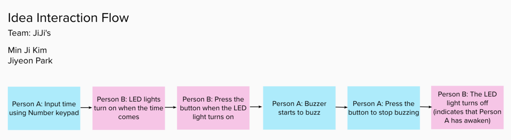

<!--panels:start-->
<!--div:title-panel-->

  # Dog Toy

<!--div:left-panel-->

Notes:



<!--div:right-panel-->


```clike

/* 
    First, setup the pins you pland to use.

    ALL CAPS for the variable name mean that it is a constant.

    Names for variable are arbitrary. Use names that are easy to understand.
*/

int PERSON_A_BUTTON_PIN = 4;
int PERSON_B_BUTTON_PIN = 5;
int PERSON_A_LED_PIN = 6;
int PERSON_B_LED_PIN = 6;
int BUZZER_PIN_1 = 7;

void startup() {
    /*
        Setup the default settings.

        Set the Pin Modes:
        https://www.arduino.cc/reference/en/language/functions/digital-io/pinmode/

        In General, SENSORS are inputs and ACTUATORS are outputs

        The terms INPUT, OUTPUT, LOW, and HIGH are constants, and thus are all caps.

    */

    // Buttons are always inputs:
    pinMode(PERSON_A_BUTTON_PIN, INPUT)
    pinMode(PERSON_B_BUTTON_PIN, INPUT)

    // LEDs are always outputs:
    pinMode(PERSON_A_LED_PIN, OUTPUT)
    pinMode(PERSON_B_LED_PIN, OUTPUT)

    // Buzzer is an output
    pinMode(BUZZER_PIN_1, OUTPUT)

    // Set the default state
    digitalWrite(PERSON_A_BUTTON_PIN, LOW) 
    digitalWrite(PERSON_B_BUTTON_PIN, LOW) 
    digitalWrite(PERSON_A_LED_PIN, LOW)
    digitalWrite(PERSON_B_LED_PIN, LOW)
    digitalWrite(BUZZER_PIN_1, LOW) 
}

void loop() {   
    /*
        Note: This is missing an inter-device connection.
    */

    /* 
        Has the time been reached?
        https://www.arduino.cc/reference/en/language/functions/time/millis/
    */
    if ( millis() >= setTime ) {
        /*
            Turn on the LED for Person A
        */
        digitalWrite(PERSON_A_LED_PIN, HIGH)
    }

    if ( digitalRead(PERSON_A_BUTTON_PIN) == HIGH ) {
        /* 
            Start the buzzer
        */
        digitalWrite(BUZZER_PIN_1, HIGH) 
    }

    if ( digitalRead(PERSON_B_BUTTON_PIN) == HIGH ) {
        /* 
            Stop the buzzer
        */
        digitalWrite(BUZZER_PIN_1, LOW) 
        /* 
            Turn off the LED
        */
        digitalWrite(PERSON_A_LED_PIN, LOW) 
    }
}

```

<!--panels:end-->


