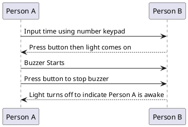

### Clock Interaction

```plantuml
@startuml
"Person A" -> "Person B": Input time using number keypad
"Person B" --> "Person A": Press button then light comes on
"Person A" -> "Person B": Buzzer Starts
"Person A" -> "Person B": Press button to stop buzzer
"Person B" --> "Person A": Light turns off to indicate Person A is awake
@enduml
```